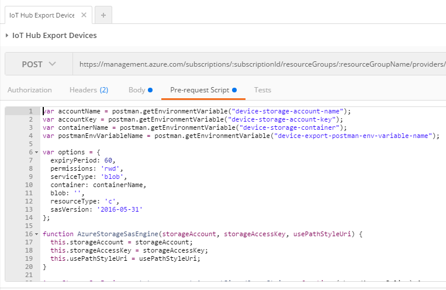

# Azure SAS Tokens for Postman

This repo contains a collections of [Postman](http://getpostman.com) Pre-request Script compatible scripts for generating Shared Access Signature (SAS) tokens to be used by the Azure REST APIs.

> You find all of my Postman related blog posts here: [Jon Gallant Blog - Tagged with 'Postman'](http://blog.jongallant.com/tags/postman/).

## Azure Storage SAS

### Generate Tokens Locally
Download (or clone this repo) the [azure-storage/azure-storage-sas-test.js](blob/master/azure-storage/azure-storage-sas-test.js) and [azure-storage/azure-storage-sas.js](blob/master/azure-storage/azure-storage-sas.js) files to run locally.

```
node azure-storage-sas-test.js account-name account-key container-name
```

Here's an example execution:
```
node azure-storage-sas-test.js jongiothubdeviceexport R+Jdx5k+O7bIjCJD8zQF3/bCALFyZjqZWz/HzgNM/mFrnOzVSYukHVdtNZqn2O/+HA+0CAZGVuKz3tqh7Lw== devices
```

It will output the following SAS Token QueryString.
```
st=2017-03-13T04%3A43%3A25Z&se=2017-03-13T05%3A43%3A25Z&sp=rwd&sv=2016-05-31&sr=c&sig=LkSBh1v4oZv1XE0YKn1s%2Fu9DuVWs6vo347Djj4yDy0s%3D

```

### Generate Tokens in Postman
To run in Postman, copy [azure-storage/azure-storage-sas-postman.js](blob/master/azure-storage/azure-storage-sas-postman.js) into the requests Pre-request Script and set the following environment variables:

> These variable names have "device-storage" in them because this was created with the Azure IoT Hub Device Export REST APIs in mind. You can change these names to whatever suits your needs.

``` javascript
var accountName = postman.getEnvironmentVariable("device-storage-account-name");
var accountKey = postman.getEnvironmentVariable("device-storage-account-key");
var containerName = postman.getEnvironmentVariable("device-storage-container");
var postmanEnvVariableName = postman.getEnvironmentVariable("device-export-postman-env-variable-name"); // This must match the name you use in subsequent requests.
```

Here's what they will look like in the Postman Environment editor.


The first part of this code file is a port of the Azure Storage Node SDK to work with Postman's sandbox.  The bottom of the file contains the code that generates the SAS QueryString and saves it to an Environment variable.  (The device-export-postman-env-variable-name setting you set above.)  You can read more about the SAS Token port form Azure Storage Node SDK to Postman here: ["How to Generate an Azure Storage Shared Access Signature (SAS) Token in Postman's Pre-request Script Sandbox"](http://blog.jongallant.com/azure-storage-sas-token-postman)

``` javascript
var storageSas = new AzureStorageSas(accountName, accountKey);
var signedQueryString = storageSas.getSignedQueryString(options);

postman.setEnvironmentVariable(postmanEnvVariableName, signedQueryString);
```

You can then use the SAS Token QueryString in subsequent Postman calls by either:

 - using double-curlys {{device-export-sas-token-querystring}}
 - using postman API postman.getEnvironmentVariable("device-export-sas-token-querystring");

#### Pre-request Script
Here's what the Pre-request Script will look like:


#### Body
Here's what the body will look like - please look for the {{device-export-sas-querystring}} addition to the URI.

(This is just an example of how it is being used in my case, you can use the token in any context).


#### Headers
Here's what the headers will look like:
(I've included this here for completeness sake, to find out more about bearerTokens, you can read my [How to Use Azure Active Directory (AAD) Access Tokens in Postman
](http://blog.jongallant.com/2017/03/azure-active-directory-access-tokens-postman/) blog post)


More SAS Token examples coming soon...